> **작성자: Claude Code** (Claude ↔ Codex 교차검증 round1 최종 종합)
> 사용 자료: **오직** 아래 2개 파일만 사용. 다른 교과서·논문·웹 자료는 쓰지 않음.
> - **[선행연구 1]** Y. W. Kwon, "Revisiting Failure of Brittle Materials," *Journal of Pressure Vessel Technology*, **143**(6), 064503 (Dec 2021). DOI: 10.1115/1.4050989
> - **[선행연구 3]** Y. W. Kwon, E. K. Markoff, S. DeFisher, "Unified Failure Criterion Based on Stress and Stress Gradient Conditions," *Materials*, **17**, 569 (Jan 2024). DOI: 10.3390/ma17030569

---

# LEFM(선형탄성파괴역학)이란? — 초보자용 설명

## 먼저, 이 두 논문의 성격 (중요)

이 두 논문은 **LEFM을 가르치려고 쓴 글이 아니다.** 둘 다 Kwon 교수 그룹이 제안한
**"응력 + 응력구배(stress gradient) 통합 파손 기준"** 을 소개·검증하는 논문이고,
LEFM은 그 안에서 **기존 이론(비교 대상)** 으로 짧게 등장한다.

그래서 Griffith 에너지 평형의 유도, 소규모 항복(small-scale yielding), K-지배영역 같은
표준 교과서 항목은 이 두 파일 **본문에는 없고 참고문헌 목록에만** 있다. 아래 설명은
"이 2개 파일 안에 실제로 쓰여 있는 문장·수식"만 모아 재구성한 것이다.

---

## 1. 한 문장 정의

> **LEFM(Linear Elastic Fracture Mechanics, 선형탄성파괴역학)** 은
> **재료가 파손 직전까지 선형탄성(응력 ∝ 변형률, Hooke 법칙)으로 거동한다고 가정하고,
> 날카로운 균열(line crack)이 있는 부재의 파손 하중을 예측하는 이론**이다.
> 균열선단 응력장의 세기를 **하나의 값 K(응력확대계수)** 로 나타내고,
> **그 세기가 재료 고유의 임계값에 도달하면 균열이 진전(파손)** 한다고 본다.

근거 문장:
- [선행연구 1] Introduction: *"If there is a line crack, the linear fracture mechanics
  approach has been applied to determine the failure load."*
- [선행연구 1] Introduction: 취성재료는 *"in general, can be considered as linear elastic
  until failure."*
- [선행연구 3] Introduction: *"A structural member with a crack has stress singularity at
  the crack tip if the material behaves linearly elastically. Thus, fracture mechanics was
  also developed for structural members with cracks."*

---

## 2. 단계별로 이해하기

### (1) 왜 "일반 강도 기준"으로는 균열을 못 다루나

균열이 없을 때 파손 판정은 간단하다 — **국부응력 σ_l 이 재료 파손강도 σ_f 이상이면 파손**
([선행연구 1] Eq. 1: σ_l ≥ σ_f).

그런데 **날카로운 균열이 있으면 균열선단의 응력이 (이상적인 선형탄성 해에서는) 무한대**가 된다.
- [선행연구 1] Case 2: *"The stress at the crack tip is infinite."*
- [선행연구 3]: *"stress singularity at the crack tip."*

응력이 무한대면 "σ_l ≥ σ_f" 는 **언제나 만족** → 이 기준만으로는 "얼마의 하중에서 부서지나"를
정할 수 없다. 그래서 균열 문제 전용 이론인 **파괴역학(fracture mechanics)** 이 따로 만들어졌다
([선행연구 3] Introduction).

```
   국부응력 σ
     ↑
     │╲
     │ ╲          σ = K / √(2πr)   ([선행연구 1] Eq. 4)
     │  ╲
     │   ╲_
     │     ‾‾‾───────____
  σ_f├─ ─ ─ ─ ─ ─ ─ ─ ─ ─ ─   ← 강도기준 선: 선단 근처에선 늘 이 선 위 → 무의미
     └─────────────────────────→  균열선단으로부터의 거리 r
     0 = 균열선단
   ※ 개념도 (정량 그래프는 아래 lefm_viz.py 참조)
```

### (2) "선형탄성"이란

- 하중을 주면 재료가 Hooke 법칙(σ = Eε)대로 늘어난다. 비선형·소성(영구변형) 없음.
  *(하중을 빼면 원래대로 돌아온다 — 이 부분은 일반적인 용어 풀이이며 두 논문이 직접 서술한 것은 아님.)*
- **취성재료**는 부서지기 직전까지 거의 이렇게 거동한다 → LEFM 적용 대상.
  [선행연구 3] §4.1은 경화 시멘트 페이스트를 *"behaved in a brittle manner with an elastic
  modulus of 20.8 GPa"* 로 기술한다.

### (3) 균열선단 응력장과 K (응력확대계수, Stress Intensity Factor)

균열선단 근처에서 응력은 **"선단으로부터의 거리의 제곱근에 반비례"** 하는 특정 형태를 가진다.

- **[선행연구 1] Eq. (4):  σ_x = K / √(2πr)**
  - σ_x : 하중 방향(균열면에 수직) 응력
  - K : 응력확대계수 &nbsp;/&nbsp; r : 균열선단으로부터의 반경거리
  - [선행연구 1]은 이 식을 Irwin(1957)에서 인용.
- **[선행연구 3] Eq. (3):  σ_e = K / √s** (s = 균열진행 방향 좌표)
  - 주의: [선행연구 3]은 √(2π)를 생략한 형태를 썼다 → 아래 §5 참조.

**핵심**: 균열선단 응력장의 "모양"은 항상 1/√r 로 같고, 그 **세기를 결정하는 단 하나의 숫자가 K**다.
K는 (작용응력) × (균열길이·형상에 의존하는 항)으로 정해진다. 덕분에 균열 문제를 "무한대 응력"이
아니라 **유한한 K 값 하나**로 다룰 수 있다.

*(K = σ√(πa) 같은 무한판 표준식의 명시적 형태는 이 두 파일 본문에는 없다. [선행연구 1] Case 2는
중심균열 길이 2a 무한판을 다루지만 K의 닫힌형 식은 제시하지 않는다.)*

### (4) 파손 판정 — 파괴인성 K_Ic 과 에너지 관점

K가 커지다가 **재료 고유의 임계값에 도달하면 균열이 진전**한다. 이 임계값이
**파괴인성(fracture toughness) K_Ic** (첨자 I = mode I = opening mode, 열림모드).

- **[선행연구 1] Case 2의 유도:**
  - 응력구배 (Eq. 5): |dσ_x/dy| = K / (2√(2π)·y^{3/2})
  - 파손구배 (Eq. 6): **w_f = K² / (2πE)** &nbsp; (E = 탄성계수)
  - (Eq. 7): **K_Ic = √(2πE·w_f)**
  - [선행연구 1]은 w_f 를 "critical value / failure gradient"인 재료상수로 부르며, 그 단위가
    J/m² 와 같다고 설명한다. *(단, w_f 를 "임계 에너지방출률"이라고 명명하지는 않는다.)*
- **[선행연구 3] Eq. (4):  Y = K² / E**
  - 본문: *"the material failure value Y is equivalent to the critical energy release rate
    in fracture mechanics."* → **Y ↔ 임계 에너지방출률 G_c** (이 동일성은 [선행연구 3]이 명시).
  - §4.3: 균열(특이점)이 있는 부재의 파손하중 예측에는 **응력구배 조건**을 쓰며, Y 값은 실험
    결과 1건에서 역산해 얻는다고 명시.

**정리**: 이 두 논문의 틀에서 균열 파손 판정은 두 관점으로 볼 수 있다 —
① **응력 관점**: K 가 K_Ic 에 도달 (등가적으로 w_f 가 임계값에 도달),
② **에너지 관점**: 에너지방출률(∝ K²/E)이 임계값 Y(≈ G_c)에 도달.

```mermaid
flowchart LR
    A[하중 작용] --> B[균열선단 응력장 형성<br/>σ = K/√&#40;2πr&#41;]
    B --> C[응력확대계수 K 계산]
    C --> D{K 가 임계값 K_Ic 에 도달?<br/>&#40;= w_f 가 임계값에 도달&#41;}
    D -- 아니오 --> E[균열 진전 안 함]
    D -- 예 --> F[Mode I 균열 진전 &#40;파손&#41;]
```



### (5) 적용 범위 / 한계 (두 파일이 서술한 선에서)

- **날카로운 균열(특이점)에는 적합, 둥근 구멍에는 그대로 쓰면 안 된다.**
  [선행연구 3] Introduction: 구멍에는 *"an entirely different set of failure criteria"*
  (임계거리 critical distance, 응집영역 cohesive zone 등)를 써 왔다고 서술.

  ```
  인장 ←  ──────────┼──────────  → 인장      균열선단: σ = K/√(2πr) → r→0 에서 발산(특이)
                     ↑
                  균열선단

  인장 ←  ─────────( ○ )────────  → 인장      원형 구멍 가장자리: 응력 유한
                   원형 구멍                   (무한판에서 최대 원주응력 = 원격응력의 3배,
                                               [선행연구 1] Kirsch 해)
  ```
  → 그래서 두 논문이 균열·구멍·무결함을 한꺼번에 다루는 **통합 기준**을 새로 제안하는 것이다.

  *각주: [선행연구 3] 서론 원문에는 "...because fracture mechanics is suitable for holes"라고
  인쇄돼 있으나, 앞뒤 문맥("On the other hand", "entirely different set")상 "is **NOT**
  suitable"의 오식(誤植)으로 보인다. 논문에 정오표는 없다.*

- 재료가 **선형탄성**이어야 한다. [선행연구 3] §3은 구멍·슬릿이 있는 특정 알루미늄 합금 시험에서
  소성변형 때문에 응력구배가 작아져 파손이 응력구배가 아니라 **응력 조건**으로 지배되었다고
  보고한다. *(이는 해당 논문의 특정 사례 결과이며, 이 두 파일이 연성재료 일반에 대한 LEFM의
  적용한계를 이론적으로 논증한 것은 아니다.)*

---

## 3. 핵심 수식 요약표 (출처 명시)

| 항목 | 식 | 출처 |
|---|---|---|
| 강도 조건 (균열 없을 때) | σ_l ≥ σ_f | [선행연구 1] Eq. 1 / [선행연구 3] Eq. 1 |
| 균열선단 응력장 | σ_x = K/√(2πr) | [선행연구 1] Eq. 4 (Irwin 1957 인용) |
| 균열선단 응력장 (간략형) | σ_e = K/√s | [선행연구 3] Eq. 3 |
| 응력구배 | \|dσ_x/dy\| = K/(2√(2π)·y^{3/2}) | [선행연구 1] Eq. 5 |
| 파손구배 ↔ K | w_f = K²/(2πE) | [선행연구 1] Eq. 6 |
| 파괴인성 | K_Ic = √(2πE·w_f) | [선행연구 1] Eq. 7 |
| 재료 파손값 ↔ K (≈ 임계 에너지방출률) | Y = K²/E | [선행연구 3] Eq. 4 |
| 응력구배 파손조건 | σ_e ≥ (2EY·\|dσ_e/ds\|)^{1/3} | [선행연구 3] Eq. 2 |

---

## 4. 정의를 구성하는 4가지 요소

1. **선형탄성 가정** — 응력·변형 관계를 선형탄성으로 본다. [선행연구 1] p.1 / [선행연구 3] p.1
2. **균열의 존재** — 균열선단에 선형탄성 해의 응력 특이성이 생긴다. [선행연구 1] p.2 / [선행연구 3] p.1
3. **응력확대계수 K** — 균열선단 1/√r 형 응력장의 크기를 나타내는 단 하나의 값. [선행연구 1] Eq.4 / [선행연구 3] Eq.3
4. **임계값 도달 = 파손** — Mode I 에서 K → K_Ic (등가적으로 w_f 또는 Y 가 임계값에 도달). [선행연구 1] Eqs.6–7 / [선행연구 3] Eq.4

---

## 5. 두 논문을 함께 쓸 때 주의할 점

1. **2π 계수 불일치**: [선행연구 1]은 σ = K/√(2πr) (2π 포함, Irwin 표준), [선행연구 3]은
   σ_e = K/√s (2π 생략). 그 결과 w_f = K²/(2πE) 와 Y = K²/E 사이에 2π 배 차이가 난다.
   [선행연구 3]은 자기 식의 K를 별도로 정의하지 않으므로, **이 불일치의 원인은 지정 2개 파일만
   으로는 확정할 수 없다.** → 각 논문 안에서는 일관되지만 **두 식을 섞어 쓰면 안 된다.**
2. **w_f 와 Y 는 같은 차원(J/m²)이지만, "임계 에너지방출률과 동등"이라고 명시된 것은
   [선행연구 3]의 Y 뿐**이다. [선행연구 1]의 w_f 는 "critical value"로만 정의된다.
3. LEFM의 역사적 기초(Griffith 에너지 평형, Irwin의 K 유도)는 이 두 파일 **본문에 없고**
   참고문헌 목록에만 있다([선행연구 3] ref 9·10 = Irwin, 11·12 = Griffith, 13 = Anderson).

---

## 6. 시각화 자료

### (a) 인라인 개념도
위 §2의 (1) 응력 특이성 도해, (4) mermaid 파손판정 순서도, (5) 균열↔구멍 대비도 참조.

### (b) 정량 그래프 스크립트 — `round1/lefm_viz.py`

matplotlib 스크립트를 함께 저장했다(한글 라벨 버그는 수정 완료). 생성 그림 4종:

| 그림 | 내용 | 근거 |
|---|---|---|
| **Fig A** | σ = K/√(2πr) 를 r에 대해 플롯 → r→0 에서 발산. σ_f 수평선을 겹쳐 "강도기준이 늘 만족되어 무의미"함을 시각화 | [선행연구 1] Eq. 4, Case 2 |
| **Fig B** | 같은 곡선 log–log → 기울기 −1/2 직선 ("1/√r 특이성") | [선행연구 1] Eq. 4 |
| **Fig C** | \|dσ_x/dy\| = K/(2√(2π)·y^{3/2}) 응력구배 곡선 | [선행연구 1] Eq. 5 |
| **Fig D** | 중심균열 길이 2a 무한판 인장 모식도 + "K = K_Ic → 균열 진전" 판정 막대그림 | [선행연구 1] Fig. 2, Eq. 7 / [선행연구 3] Eq. 4 |

**실행 방법** (이 세션에는 Python 인터프리터가 없어 직접 생성하지 못함):
```
python round1/lefm_viz.py
```
→ `round1/figs/` 에 `figA_singularity.png`, `figB_loglog.png`, `figC_gradient.png`,
`figD_concept.png` 4장 생성. 스크립트에는 라이브러리·경로·인코딩 확인과 수식 self-check
(assert)가 포함돼 있다.

*주의: 스크립트의 예시 수치(K, E, σ_f)와 Fig D의 w_f 값은 **개념 설명용 임의값**이며, 논문의
실측 데이터가 아니다. 생성되는 K_Ic 를 실제 재료값으로 해석하지 말 것.*

---

## 7. 결론 (이 2개 파일이 답하는 범위 내에서)

**LEFM =**
① **선형탄성 가정** (취성재료, 파손까지 σ ∝ ε)
② **날카로운 균열** 문제 전용
③ 균열선단 응력장을 **K 하나**로 요약 (σ ∝ K/√r)
④ 파손 판정 = **K 가 K_Ic 에 도달** (이 두 논문에서는 등가적으로 응력구배 조건 / w_f / Y ≈ G_c 로 표현)

둥근 구멍·둔한 노치·큰 소성변형에는 그대로 쓸 수 없고(→ 두 논문의 통합기준이 나온 이유),
Griffith/Irwin 유도 등 표준 이론사는 이 두 파일 본문 밖(참고문헌)에 있다.

---

## 참고문헌 — 지정된 두 자료만 사용

[선행연구 1] Kwon, Y. W., "Revisiting Failure of Brittle Materials," *Journal of Pressure
Vessel Technology*, **143**(6), 064503, 2021. https://doi.org/10.1115/1.4050989

[선행연구 3] Kwon, Y. W., Markoff, E. K., DeFisher, S., "Unified Failure Criterion Based on
Stress and Stress Gradient Conditions," *Materials*, **17**, 569, 2024.
https://doi.org/10.3390/ma17030569

---

### 부록: 교차검증 경과 (Claude ↔ Codex)

- **공통 확인**: 핵심 정의·수식(σ=K/√(2πr), w_f=K²/(2πE), K_Ic=√(2πE·w_f), Y=K²/E)과 인용
  위치는 양측이 원문 대조로 일치 확인.
- **Codex 지적 반영**: w_f 와 Y 를 구분(w_f 를 에너지방출률로 명명하지 않음), 2π 불일치는
  "정규화 차이"로 단정하지 않고 미해결로 서술, "suitable for holes"는 오식 가능성으로만 표기.
- **Claude 지적 반영**: 이 두 논문의 실제 방법인 **응력구배 조건**을 함께 소개, 두 논문이 LEFM
  교과서가 아니라는 자료 한계를 앞세움, 출처에 없는 예시(유리·세라믹·PMMA)와 연성재료 일반화 제거.
- **남은 작업**: `lefm_viz.py` 실제 실행 → figs PNG 4장 생성·육안 검증(Python 환경 필요).
