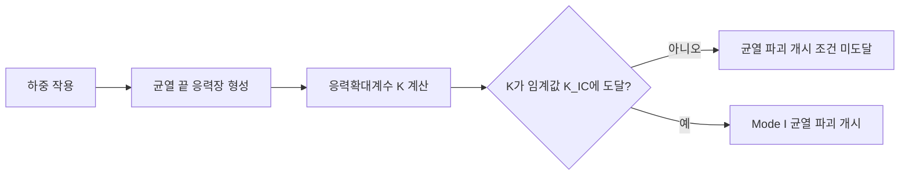

# LEFM(선형탄성 파괴역학)의 정의

## 한 문장 정의

**LEFM(Linear Elastic Fracture Mechanics, 선형탄성 파괴역학)은 재료가 파괴 직전까지 선형탄성적으로 거동한다고 보고, 균열 끝(crack tip)에 형성되는 매우 큰 응력장을 응력확대계수 (K)로 나타내어 균열의 파괴 개시를 판단하는 접근법이다.**

이 정의는 다음 두 원문 진술을 합쳐 정리한 것이다.

- 선행연구 1은 등방성 취성재료가 일반적으로 파괴할 때까지 선형탄성으로 간주될 수 있다고 설명하고, 선형 균열이 있으면 선형 파괴역학을 이용해 파괴하중을 정한다고 서술한다.[1, p. 1]
- 선행연구 3은 재료가 선형탄성적으로 거동할 때 균열 끝에 응력 특이성(stress singularity)이 생기며, 이 때문에 균열을 가진 구조물에 파괴역학이 개발되었다고 설명한다.[2, p. 1]

## 초보자를 위한 직관

종이에 작은 칼집을 내면, 같은 힘으로 잡아당겨도 칼집 끝에서부터 찢어지기 쉽다. 구조재의 균열도 비슷하다. 멀리서 작용하는 평균응력이 그다지 크지 않아도, 균열 끝에서는 응력이 매우 크게 증폭된다. LEFM은 이 **균열 끝의 증폭 정도**를 (K)라는 하나의 대표값으로 표현한다.

선행연구 1이 제시한 균열 끝 부근의 응력은 다음과 같다.[1, p. 2, Eq. (4)]

\[
\sigma_x=\frac{K}{\sqrt{2\pi r}}
\]

- (\sigma_x): 균열 끝 부근의 국부응력
- (K): 응력확대계수(stress intensity factor)
- (r): 균열 끝에서 떨어진 거리

(r)이 작아질수록 분모가 작아지므로, 이상적인 선형탄성 해에서는 (r\to0)일 때 응력이 무한대로 증가한다. 이것이 **균열 끝 응력 특이성**이다.[1, p. 2; 2, p. 1]

```text
국부응력 σ
  ↑
  │╲
  │ ╲      σ ∝ K/√r
  │  ╲
  │    ╲____
  └────────────→ 균열 끝으로부터의 거리 r
  0 = 균열 끝

※ 개념도이며 정량 그래프가 아니다.
```

여기서 중요한 점은 “균열 끝의 응력이 무한대이므로 곧바로 파괴된다”는 뜻이 아니라는 것이다. 선행연구 1에서는 균열 끝의 국부응력이 이미 재료 강도를 넘기 때문에, 균열 문제에서는 응력장 크기를 나타내는 (K)와 임계값의 비교가 핵심이 된다고 설명한다.[1, p. 2]

## LEFM의 파괴 판단

개구형(Mode I) 균열에 대해 재료의 임계 응력확대계수를 **파괴인성 (K_{IC})**라고 한다. 선행연구 1은 균열 끝 응력장으로부터 (K_{IC})와 재료의 임계 파괴값 (w_f) 사이의 관계를 다음처럼 제시한다.[1, p. 2, Eqs. (6)–(7)]

\[
w_f=\frac{K^2}{2\pi E}, \qquad
K_{IC}=\sqrt{2\pi E w_f}
\]

따라서 이 논문의 틀에서 Mode I 파괴 개시는 다음과 같이 이해할 수 있다.



즉, **$K$는 현재 하중과 균열이 만드는 균열 끝 응력장의 세기**, **$K_{IC}$는 재료가 견딜 수 있는 임계값**으로 이해하면 된다. 선행연구 3도 균열 끝 근방 응력을 $\sigma_e=K/\sqrt{s}$의 형태로 쓰고, 파괴 개시 시 $Y=K^2/E$가 되어 재료 파괴값 $Y$가 파괴역학의 임계 에너지 방출률과 동등하다고 설명한다.[2, p. 2, Eqs. (3)–(4)] 두 논문의 식은 표기상 계수가 다르므로 수치 계산에서는 각 논문이 정의한 $K$를 그대로 따라야 한다. 다만 두 식 모두 **응력이 거리의 제곱근에 반비례하고 그 크기를 $K$가 정한다**는 동일한 구조를 보여준다.

## 균열과 단순 구멍은 왜 다른가

```text
인장하중 ←  ──────────┼──────────  → 인장하중
                      ↑
                   균열 끝
              σ ∝ K/√r : 특이 응력장

인장하중 ←  ─────────( ○ )────────  → 인장하중
                    원형 구멍
                유한한 최대응력
```

선행연구 1의 중앙균열 평판에서는 이상화된 균열 끝 응력이 무한대로 발산하지만, 중앙 원형 구멍 가장자리의 응력은 유한하다. 무한 평판의 원형 구멍에서는 최대 원주응력이 원격 인장응력의 3배로 제시된다.[1, p. 2, Fig. 2–3 및 Eqs. (9)–(12)] 선행연구 3도 균열에는 파괴역학을 사용하지만 구멍에는 별도의 파손기준이 사용되어 왔다고 구분한다.[2, p. 1]

따라서 이 두 자료가 설명하는 LEFM의 직접 대상은 **날카로운 균열과 그 끝의 특이 응력장**이다. 둥근 구멍처럼 응력이 유한한 노치 문제를 단순히 같은 방식으로 취급하면 안 된다.

## 정의를 구성하는 네 요소

1. **선형탄성 가정**: 응력과 변형의 관계를 선형탄성으로 본다.[1, p. 1; 2, p. 1]
2. **균열의 존재**: 균열 끝에는 선형탄성 해의 응력 특이성이 생긴다.[1, p. 2; 2, p. 1]
3. **응력확대계수 (K)**: 균열 끝 부근의 (1/\sqrt{r})형 응력장의 크기를 나타낸다.[1, p. 2; 2, p. 2]
4. **임계 파괴값**: Mode I에서는 (K)가 재료의 파괴인성 (K_{IC})에 도달하는지가 파괴 개시 판단의 핵심이다.[1, p. 2]

## 적용할 때 기억할 점

- LEFM은 구조 전체의 평균응력만 보는 방법이 아니라 **균열 끝의 국부 응력장**을 보는 방법이다.
- 이상적인 균열 끝 응력 자체는 특이하므로, 그 점의 “무한대 응력”을 재료강도와 직접 비교하는 대신 (K)와 임계값을 사용한다.[1, p. 2]
- 두 선행연구는 LEFM이 특히 선형탄성 거동과 날카로운 균열을 전제로 설명된다는 점을 보여준다. 그러므로 큰 비선형 변형이 지배적이거나 둥근 구멍만 있는 문제까지 이 정의를 무조건 확대 적용할 근거는 이 두 자료에 없다.

## 참고문헌 — 지정된 두 자료만 사용

[1] Kwon, Y. W., “Revisiting Failure of Brittle Materials,” *Journal of Pressure Vessel Technology*, Vol. 143, 064503, 2021. https://doi.org/10.1115/1.4050989

[2] Kwon, Y. W., Markoff, E. K., and DeFisher, S., “Unified Failure Criterion Based on Stress and Stress Gradient Conditions,” *Materials*, Vol. 17, 569, 2024. https://doi.org/10.3390/ma17030569

---

**범위 고지:** 이 설명은 요청대로 `[선행연구 1]`과 `[선행연구 3]`의 내용만 사용해 작성했다. 다른 교과서·논문·웹 자료는 사용하지 않았다.
